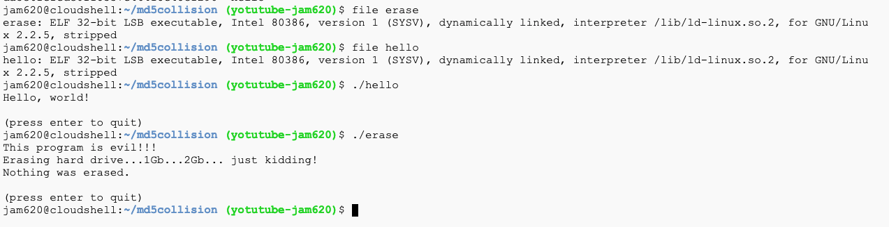

# Colisiones Hash MD5 y SHA1

He tenido la oportunidad de dictar un curso sobre criptografía y me gustaría compartir un poco sobre un tema tan importante como las colisiones, primero vamos a explicar que es una colisión MD5 la cual es una situación en la que se encuentran dos valores que producen el mismo valor hash. Esto es posible debido a la naturaleza matemática de la función hash. Aunque el espacio de valores hash es grande, no es infinito. Por lo tanto, es posible que se produzcan colisiones. 

Antes de continuar debemos mencionar el uso y las características principales de los hash, el principal propósito es asegurar la integridad, es decir comprobar si algo ha cambiado en un archivo, saber que el mismo ha sido alterado. Lo hash toman una entrada arbitraria y producen una cadena de un largo fijo 32 dígitos hexadecimales para hash md5 y 40  dígitos  hexadecimales para sha1.

Los principales atributos que todos lo hashes deben seguir con los siguientes;

1. La misma entrada siempre produciría la misma salida.
2. Multiples entradas diferentes no deben producir la misma salida.
3. No debe ser posible obtener de la salida la entrada.
4. Cualquier modificación de una entrada debe resultar en un cambio drástico al hash.

### Demostración Hash MD5

Es importante recalcar que el hash md5 ya esta obsoleto porque se lograron realizar colisiones y por tanto es una función hash que no debemos utilizar, no obstante para la demostración de los atributos no sirve de base, vamos a crear un archivo y luego sacaremos el hash MD5

Si observamos el valor del hash `3c6281608475434533433080bf082036` debe ser único, vamos a modificarlo el archivo debe cambiar de valor hash

Ahora obtenemos el nuevo valor `dfd430361478fb2555c4668cc821d923`, si realizamos una copia y verificamos el hash del nuevo archivo deben ser iguales

Hemos comprobado los atributos, podríamos usar powershell y verificar que el resultado es el mismo indistintamente del sistema operativo, la única diferencia sería que ese encuentra en mayúscula.

Si modificamos y tenemos el hash podemos confirmar con md5sum si hay modificaciones o si el archivo no ha sido alterado, esto es similar a cuando descargamos una ISO por ejemplo la de Kali Linux y queremos validar si se descargar correctamente.

Efectivamente verificamos  ha sido modificado

### Colisiones en Hash MD5

Para la demostración usaremos dos archivos que descargamos del siguiente enlace https://www.mscs.dal.ca/~selinger/md5collision/ y la realizaré desde la [consola de google](https://console.cloud.google.com/)

Los archivos a utilizar son para sistemas operativos Linux: 

* hello
* erase 

A continuación observamos que son dos archivos diferentes y como resultado arrojan el mismo hash 

Esto lo podemos confirmar observando el contenido de cada archivo, notamos que ambos son archivos ejecutables ELF y cada uno arroja una información diferente

Por último vamos a sacar el valor hash usando sha256 y compramos lo que habíamos mencionado anteriormente son dos archivos distintos.

### Colisiones en Hash SHA1

En esta ocasión haremos lo mismo pero utilizando otros archivos, en este caso los descargamos de https://shattered.io/ utilizaremos los archivos:

* shattered-1.pdf
* shattered-2.pdf

Podemos visualizar que son dos archivos diferentes

Vamos a calcular el valor hash SHA1 y comprobamos que el hash el valor es el mismo

Si procedemos a realizar el mismo resultado pero en esta ocasión con sha256, el resultado del hash debe cambiar

El objetivo de este articulo bastante corto, era demostrar el porque no debemos utilizar algoritmos con colisiones comprobadas, otras ejemplos prácticos lo podemos ver en sitios especializados como Try Hack Me y sus rooms para crackear Hash y contraseñas.

### Referencias

1. *Peter Selinger: MD5 Collision Demo*. (n.d.). MD5 Collision. Retrieved June 12, 2022, from https://www.mscs.dal.ca/%7Eselinger/md5collision/
2. *SHAttered*. (n.d.). SHAttered. Retrieved June 12, 2022, from https://shattered.io/
3. https://tryhackme.com/room/johntheripper0
4. https://tryhackme.com/room/hashingcrypto101